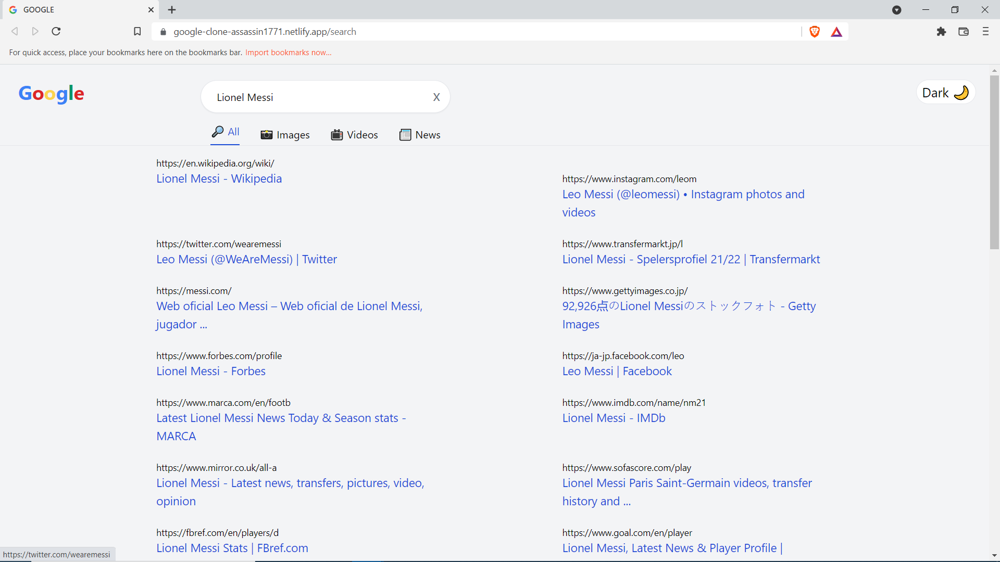
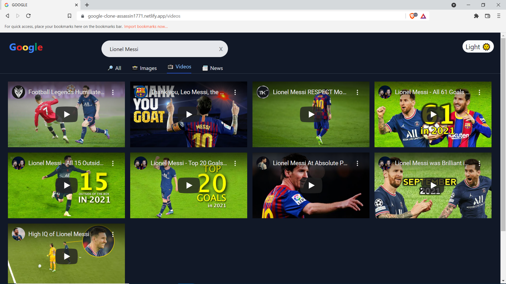

# GOOGLE SEARCH CLONE

➤ A Google Search Clone, on which you can search for anything.
 
➤ It provides information, images, videos and news on the searched item.
 
➤ It also has the added functionality of Dark Mode.
 
➤ Visit the Website : https://google-clone-assassin1771.netlify.app/

 
 

 

 
 
 

## Installation and Setup Instructions

Clone down this repository. You will need node and npm installed globally on your machine.

Installation:
 
npm install

To Run Test Suite:
 
npm test

To Start Server:
 
npm start

To Visit App:
 
http://localhost:3000
 
 
 
